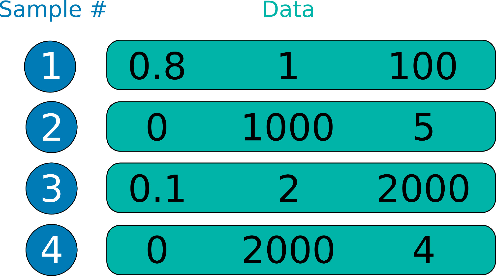
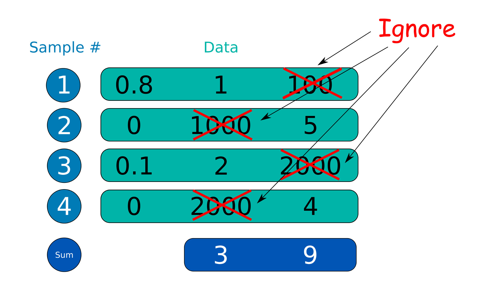

# Applying operations conditionally based on a value in each sample in TensorFlow

When you use TensorFlow, you build a computational graph first, then call run() within a session
 to do the actual calculation unless you use it in the eager execution mode.
 
 This makes it coming up with code challenging to do what would be a simple task in Python.
 
 Let's take a look at the below example:



There are 4 samples in this dataset.
Each sample is a 3-dimensional vector.
This data is first defined as an ndarray, then fed to the tfSession.run() method in feed_dict as the value for a placeholder. 
 
```
     a = np.array([[0.8, 1, 100], [0, 1000, 5], [0.1, 2, 2000], [0, 2000, 4]])
```

The objective is the following:

* Calculate the sum of 2nd elements of each sample if the first element is greater than 0
* Calculate the sum of 3nd elements of each sample if the first element is 0

>

In this example, the first sample has 0.8 in the first element, therefore, keep the 2nd element and ignore the third element.
For the second element, the first element is 0, so ignore the second element and keep the third element.
Applying the same logic to the third and fourth elements.

As far as I know, you cannot use tf.cond method as it requires the condition to be a scalar number.


