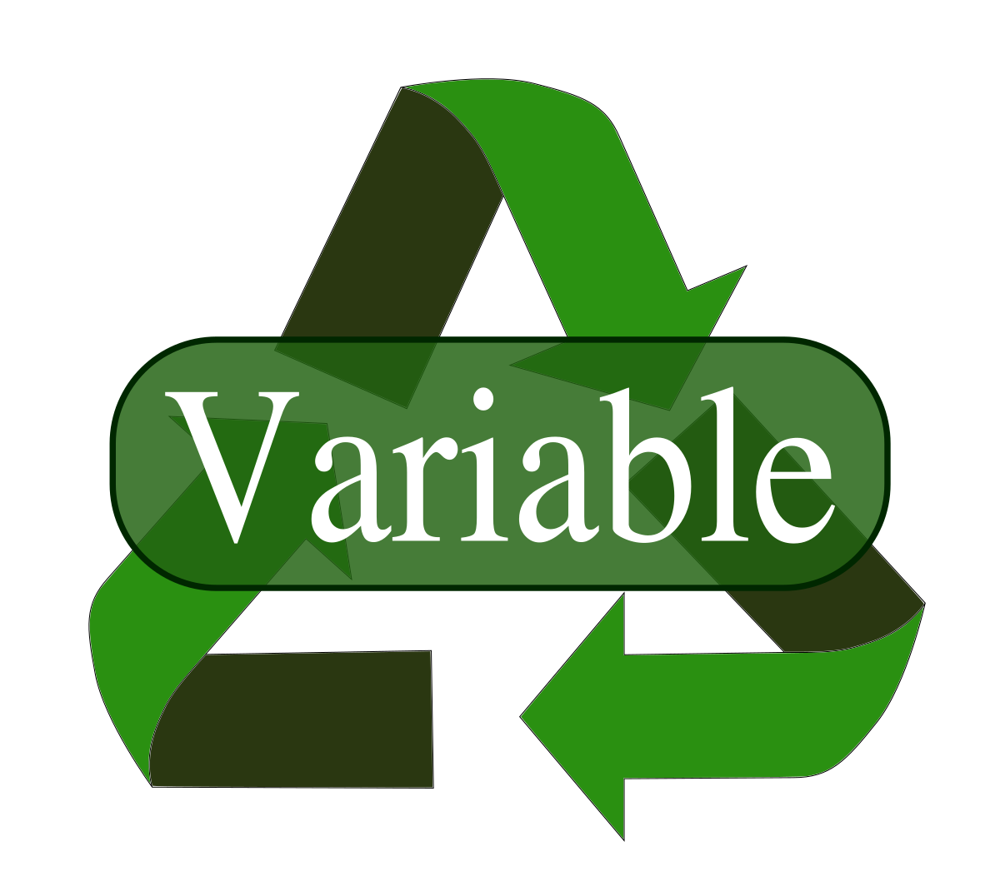
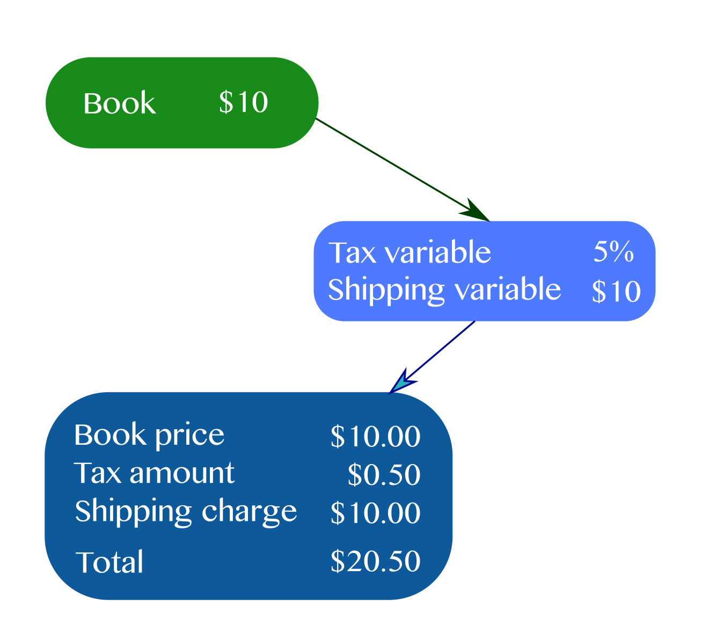

# What does variable reuse mean in TensorFlow?
By Hide Inada



If you are new to TensorFlow, variables in TensorFlow may look complicated and overwhelming, especially if you see it used for defining a network layer weight.  Once you get a hang of it, you realize that it is not as scary as it first looked.  However, some of you may not be familiar with the concept of "reuse", which is a very useful way of using variables. In this article, I'd like to clarify what "reuse" mean for TensorFlow variables.
<hr>
Let's think of a case where you want to write a function for calculating the total price of an item by adding tax and shipping.  
In this scenario, tax is set to 5% of the unit price of an item, and the shipping charge is fixed at $10 per item.



Here is the code:

```

def add_tax_and_shipping(price):
    """Add tax and shipping
    """

    with tf.variable_scope("other_charge") as scope:
        tax = tf.get_variable("tax", (), dtype=tf.float32,
                              initializer=tf.constant_initializer(0.05))  # 0.05%

        shipping = tf.get_variable("shipping", (), dtype=tf.float32,
                                   initializer=tf.constant_initializer(10.0))  # $10

    total_price = price * (1.0 + tax) + shipping
    return total_price
```

This function is called to calculate the total price of a book in the below code:
```
def main():
    book_price = add_tax_and_shipping(10.0)

    init_op = tf.global_variables_initializer()  # Set up operator to assign all init values to variables

    with tf.Session() as s:
        s.run(init_op)  # Actually assign initial value to variables

        price = s.run(book_price)
        print("Price of the book: %f" % (price))


if __name__ == "__main__":
    main()

```
When you run it, you get:

```
Price of the book: 20.500000
```

This is all good.

You may wonder why this logic is in a function, but for now, let's just assume that this is because of you are thinking of adding more complicated logic to calculate tax and shipping (e.g. by state, by city) later on.

Then you decided to pass a sketch pad to the function to calculate tax and shipping.  Your intent is
to use the same tax rate and shipping charge as the book:

```
    book_price = add_tax_and_shipping(10.0)
    sketchpad_price = add_tax_and_shipping(20.0)
``` 

When you run this, you will see:
```
ValueError: Variable other_charge/tax already exists, disallowed. Did you mean to set reuse=True or reuse=tf.AUTO_REUSE in VarScope? 
```

The reason you are getting this error is because TensorFlow prohibits calling the get_variable function for the same variable
again by default.

How can you work around this?

Well, TensorFlow has a special keyword called 'reuse'.

You specify the reuse keyword in the variable_scope.  Let's see what happens if you set this to True:
```
    with tf.variable_scope("other_charge", reuse=True) as scope:  # This line causes an exception to be thrown on the next line!
        tax = tf.get_variable("tax", (), dtype=tf.float32,
                              initializer=tf.constant_initializer(0.05))  # 0.05%

        shipping = tf.get_variable("shipping", (), dtype=tf.float32,
                                   initializer=tf.constant_initializer(10.0))  # $10
```

Unfortunately, this time you will get:
```
ValueError: Variable other_charge/tax does not exist, or was not created with tf.get_variable(). Did you mean to set reuse=tf.AUTO_REUSE in VarScope?
```

So in order to use reuse=True, the variable has to already exist.

There are two solutions for this:

First solution is to change the reuse argument value from True to tf.AUTO_REUSE

```
   with tf.variable_scope("other_charge", reuse=tf.AUTO_REUSE) as scope: 
```

With this change in place, let's add some code to main() that calculates the total price of the sketch pad and also doubling the tax rate:
```
def main():
    book_price = add_tax_and_shipping(10.0)
    sketchpad_price = add_tax_and_shipping(20.0)

    init_op = tf.global_variables_initializer()  # Set up operator to assign all init values to variables

    with tf.Session() as s:
        s.run(init_op)  # Actually assign initial value to variables

        price = s.run(book_price)
        print("Price of the book: %f" % (price))

        price = s.run(sketchpad_price)
        print("Price of the sketchpad: %f" % (price))

    # Try to double tax!
    graph = tf.get_default_graph()
    tax = graph.get_tensor_by_name("other_charge/tax:0")

    print("Doubling tax")
    double_tax = tf.assign(tax, tax * 2.0)
    with tf.Session() as s:
        s.run(init_op)  # Actually assign initial value to variables

        s.run(double_tax)

        price = s.run(book_price)
        print("Price of the book: %f" % (price))

        price = s.run(sketchpad_price)
        print("Price of the sketchpad: %f" % (price))
```

When you run this, you will get:

```
Price of the book: 20.500000
Price of the sketchpad: 31.000000
Doubling tax
Price of the book: 21.000000
Price of the sketchpad: 32.000000
```

So now you know that the new tax rate is applied to both the book and the sketch pad correctly.

tf.AUTO_REUSE is convenient, but you also have to be careful for not inadvertently sharing variables.
For example, one of my CIFAR-10 scripts defines a convolutional layer using a function below:

```
def single_conv_block(tens, block_name, input_filters, output_filters, kernel_size=3, padding="SAME", strides=1,
                      is_training=True):
    scope_name = block_name + "_cv"
    with tf.variable_scope(scope_name) as scope:
        weights = tf.get_variable("weights", [kernel_size, kernel_size, input_filters, output_filters],
                                  dtype=tf.float32,
                                  initializer=tf.contrib.layers.xavier_initializer(uniform=False, seed=0))
        bias = tf.get_variable("bias", [output_filters], dtype=tf.float32)

        z = tf.add(tf.nn.conv2d(tens, weights, strides=[1, strides, strides, 1], padding=padding), bias)

        bn = tf.layers.batch_normalization(z, training=is_training)

        activation = tf.nn.relu(bn, name=scope.name)

        return activation
```

If I forget to use different block_name and also set reuse to tf.AUTO_REUSE, multiple convolutional layers will end up using
the same weights, which is clearly not what I want.

So if you want to explicitly define reuse of variable, here is the second solution:

```
def add_tax_and_shipping(price, reuse=False):
    """Add tax and shipping
    """

    with tf.variable_scope("other_charge", reuse=reuse) as scope:
        tax = tf.get_variable("tax", (), dtype=tf.float32,
                              initializer=tf.constant_initializer(0.05))  # 0.05%

        shipping = tf.get_variable("shipping", (), dtype=tf.float32,
                                   initializer=tf.constant_initializer(10.0))  # $10
```

```
def main():
    book_price = add_tax_and_shipping(10.0)
    sketchpad_price = add_tax_and_shipping(20.0, reuse=True)
```

This outputs the same result.

I didn't cover this, but there is one more option using scope.reuse_variables() which is discussed in [1]

# Final words
Here is the summary
* reuse means sharing the same variable between different callers
* If you want to share the variable, the second caller explicitly specifies "reuse=True"
* or declare the variable scope as "tf.AUTO_REUSE"

If you have any feedback, please feel free to reach out to me.

# References
&#91;1&#93; TensorFlow team. Variables. https://www.tensorflow.org/guide/variables

&#91;2&#93; TensorFlow team. tf.variable_scope. https://www.tensorflow.org/api_docs/python/tf/variable_scope


 
